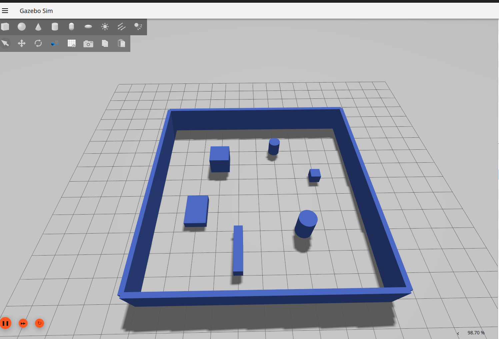
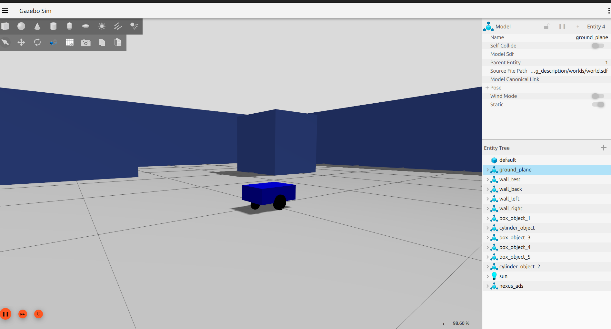
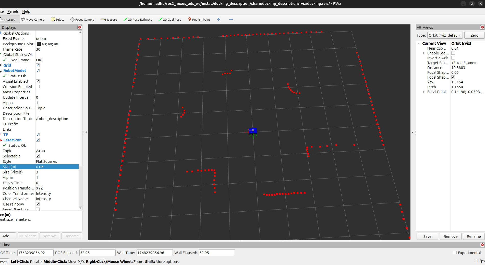
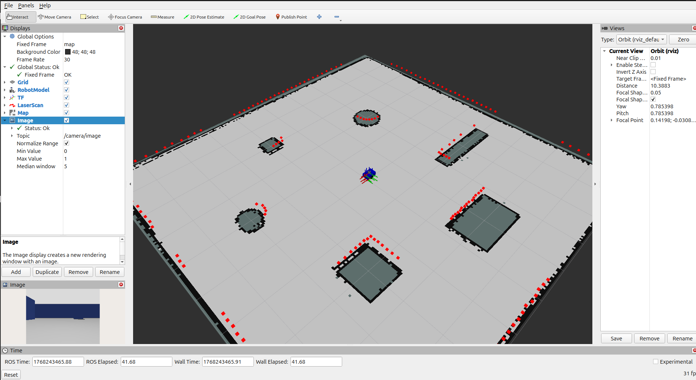
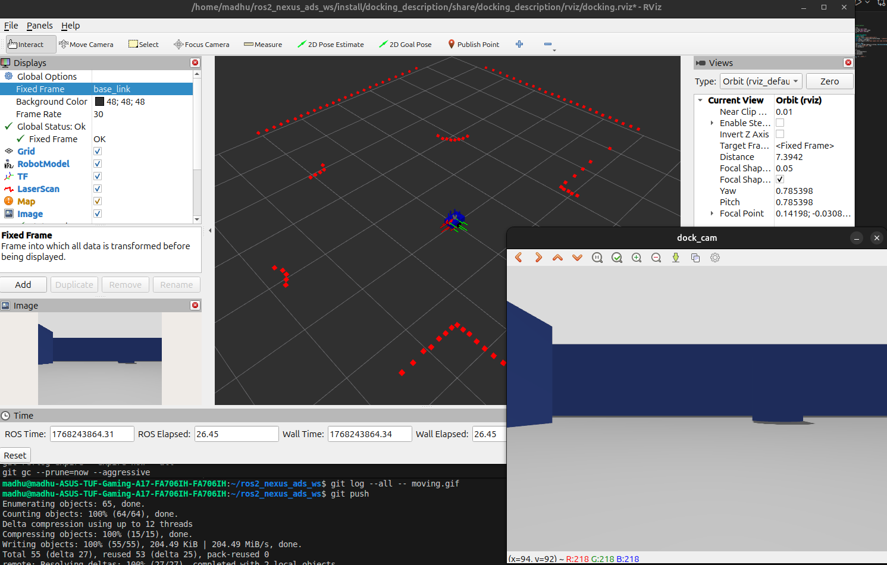
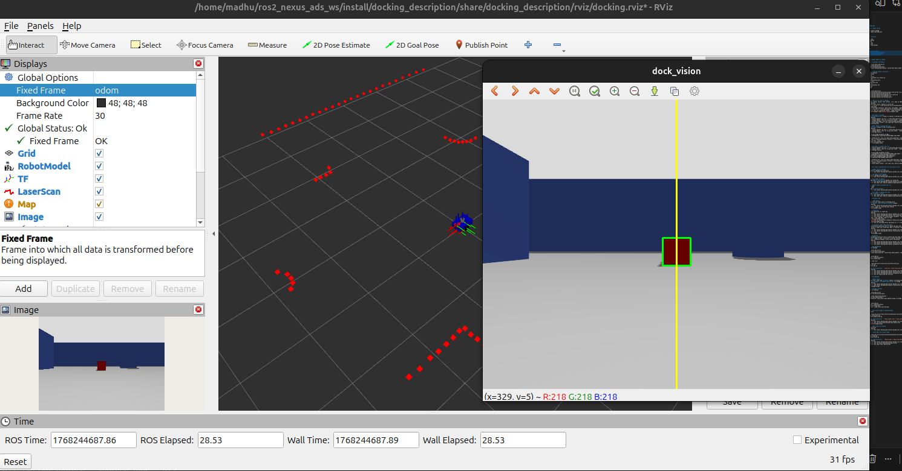

# ROS2_NEXUS_ADS

### Convert videos to gif
```
sudo apt install ffmpeg
ffmpeg -i demo.webm demo.gif
```


### Kill terminals
```
pkill -f ros2
pkill -f gazebo
pkill -f gz
pkill -f rviz
pkill -f nav2
pkill -f slam_toolbox
```

### BUILD
```
cd ~/ros2_nexus_ads_ws
source /opt/ros/jazzy/setup.bash
colcon build --symlink-install
source install/setup.bash
clear
```

## GOAL 1: Render model in Gazebo

### STEP 1: Creating a workspace
```
mkdir -p ~/ros2_nexus_ads_ws/src
cd ~/ros2_nexus_ads_ws/src
source /opt/ros/jazzy/setup.bash
ros2 pkg create docking_description --build-type ament_cmake
```

### STEP 2: Creating folders structure
docking_description/
    ├── config/
        ├── 
    ├── launch/
        ├── gazebo_rviz.launch.py
    ├── urdf/
        ├── docking.xacro
    ├── worlds/
        ├── world.sdf
    ├── rviz/
        ├── docking.rviz
    ├── maps/
        ├── 

```
cd ~/ros2_nexus_ads_ws/src
mkdir -p docking_description/{config,launch,urdf,worlds,rviz,maps}
touch docking_description/worlds/world.sdf
touch docking_description/launch/gazebo_rviz.launch.py
touch docking_description/rviz/docking.rviz
touch docking_description/urdf/docking.xacro
```

### STEP 3: Code to run robot in gazebo
- Add folder config, launch, urdf, worlds, rviz, maps to CMakeLists.txt
- [BUILD](#build)
- Add Ground Plane, walls, objects in world.sdf
- Terminal 1: gz sim -r ~/ros2_nexus_ads_ws/src/docking_description/worlds/world.sdf

- Add robot with base_footprint, base_link, left_wheel, right_wheel, caster_wheel_back, caster_wheel_front with their joints in docking.xacro
- Terminal 1: gz sim -r ~/ros2_nexus_ads_ws/src/docking_description/worlds/world.sdf
- Terminal 2: ros2 run ros_gz_sim create   -name nexus_ads -file ~/ros2_nexus_ads_ws/src/docking_description/urdf/docking.xacro



## GOAL 2: Move model in Gazebo
- Add **JointStatePublisher** plugin at ending of docking.xacro
- [BUILD](#build)
- Terminal 1(Start Gazebo): gz sim -r ~/ros2_nexus_ads_ws/src/docking_description/worlds/world.sdf
- Terminal 2(Spawn Robot): ros2 run ros_gz_sim create   -name nexus_ads   -file ~/ros2_nexus_ads_ws/src/docking_description/urdf/docking.xacro
- Terminal 3(Create Bridge): ros2 run ros_gz_bridge parameter_bridge   /cmd_vel@geometry_msgs/msg/Twist@gz.msgs.Twist
- Terminal 4(Move Robot linear): ros2 topic pub /cmd_vel geometry_msgs/msg/Twist "{linear: {x: 0.5}, angular: {z: 0.0}}"
- 

## GOAL 3: Render model in gazebo and rviz
- Add **DiffDrive** plugin at end of docking.xacro
- [BUILD](#build)
- Terminal 1(Start Gazebo): gz sim -r ~/ros2_nexus_ads_ws/src/docking_description/worlds/world.sdf
- Terminal 2(Spawn Robot): ros2 run ros_gz_sim create   -name nexus_ads   -file ~/ros2_nexus_ads_ws/src/docking_description/urdf/docking.xacro
- Terminal 3(Bridge Joints): 
```
ros2 run ros_gz_bridge parameter_bridge \
    /joint_states@sensor_msgs/msg/JointState@gz.msgs.Model
```
- Terminal 4(Publish TF): ros2 run robot_state_publisher robot_state_publisher \
    --ros-args -p robot_description:="$(xacro ~/ros2_nexus_ads_ws/src/docking_description/urdf/docking.xacro)"
- Terminal 5(rviz): rviz2
- Save config into docking.rviz
- 


## GOAL 4: Move model in gazebo and rviz
- Terminal 1(Start Gazebo): gz sim -r ~/ros2_nexus_ads_ws/src/docking_description/worlds/world.sdf
- Terminal 2(Spawn Robot): ros2 run ros_gz_sim create   -name nexus_ads   -file ~/ros2_nexus_ads_ws/src/docking_description/urdf/docking.xacro
- Terminal 3(Bridge Joints): 
```
ros2 run ros_gz_bridge parameter_bridge \
    /joint_states@sensor_msgs/msg/JointState@gz.msgs.Model \
    /cmd_vel@geometry_msgs/msg/Twist@gz.msgs.Twist \
    /odom@nav_msgs/msg/Odometry@gz.msgs.Odometry \
    /tf@tf2_msgs/msg/TFMessage@gz.msgs.Pose_V 
```
- Terminal 4(Publish TF): ros2 run robot_state_publisher robot_state_publisher \
    --ros-args -p robot_description:="$(xacro ~/ros2_nexus_ads_ws/src/docking_description/urdf/docking.xacro)"
- Terminal 5(rviz): rviz2
- Terminal 6(Move Robot linear): ros2 topic pub /cmd_vel geometry_msgs/msg/Twist "{linear: {x: 0.5}, angular: {z: 0.0}}"


## GOAL 5: Move model in gazebo and rviz via launch files

### Step 1: Render world in gazebo
- Render world in gazebo_rviz.launch.py
- Terminal 1: ros2 launch docking_description gazebo_rviz.launch.py

### Step 2: Add model to the gazebo
- Add spawn in  gazebo_rviz.launch.py
- Terminal 1: ros2 launch docking_description gazebo_rviz.launch.py

### Step 3: Move model in gazebo
- Add bridge with **/cmd_vel** in gazebo_rviz.launch.py
- Terminal 1: ros2 launch docking_description gazebo_rviz.launch.py
- Terminal 2: ros2 topic pub /cmd_vel geometry_msgs/msg/Twist "{linear: {x: 0.5}, angular: {z: 0.0}}"

### Step 4: Render model in gazebo and rviz
- Add rviz node
- Add rsp node
- Add bridge **/joint_states**
- Terminal 1: ros2 launch docking_description gazebo_rviz.launch.py

### Step 5: Move model in gazebo and rviz
- Add bridge **/odom**, **/tf**
- Terminal 1: ros2 launch docking_description gazebo_rviz.launch.py
- Terminal 2: ros2 topic pub /cmd_vel geometry_msgs/msg/Twist "{linear: {x: 0.5}, angular: {z: 0.0}}"

## GOAL 6: Creating a map

### Step 1: LiDAR Setup
- Add lidar_link and lidar_joint in docking.xacro
- Add **gpu_lidar**, **gz-sim-sensors-system** plugin
- [BUILD](#build)
- Terminal 1: ros2 launch docking_description gazebo_rviz.launch.py
- Add ScanLaser, topic as /scan and save config
- 

### Step 2: Create map
- Create slam.launch.py to create map
- [BUILD](#build)
- Terminal 1: ros2 launch docking_description gazebo_rviz.launch.py
- Terminal 2: ros2 launch docking_description slam.launch.py
- Terminal 3: ros2 lifecycle set /slam_toolbox configure  ros2 lifecycle set /slam_toolbox activate
- Fixed Frame -> map, Add Map, topic as /map
- 
- Terminal 4: ros2 run teleop_twist_keyboard teleop_twist_keyboard
- 
- Terminal 5: ros2 run nav2_map_server map_saver_cli -f ~/ros2_nexus_ads_ws/src/docking_description/maps/my_map

## GOAL 6: Localization (auto load saved map)
- Create localization.launch.py file in launch and amcl.yaml in config
- Add Map Server → loads your saved map, AMCL → localizes robot in that map, Lifecycle Manager → automatically starts them
- [BUILD](#build)
- Terminal 1: ros2 launch docking_description gazebo_rviz.launch.py
- Terminal 2: ros2 launch docking_description localization.launch.py
- Fixed Fram -> map
- 

## GOAL 6: Navigation
- Create navigation.launch.py file in launch and nav2.yaml in config
- Add Planner → makes a path, Controller → follows the path, Behavior tree → orchestrates navigation, Recovery behaviors → unstuck logic, Velocity smoother → smooth motion, Lifecycle manager → auto-starts everything
- [BUILD](#build)
- Terminal 1: ros2 launch docking_description gazebo_rviz.launch.py
- Terminal 2: ros2 launch docking_description localization.launch.py
- Terminal 3: ros2 launch docking_description navigation.launch.py

## GOAL 7: AUTO NAVIGATION
- Create new package
```
cd ~/ros2_nexus_ads_ws/src
source /opt/ros/jazzy/setup.bash
ros2 pkg create nexus_auto_nav --build-type ament_python --dependencies rclpy nav2_msgs geometry_msgs
```
```
cd ~/ros2_nexus_ads_ws
colcon build --symlink-install
source install/setup.bash
```
- Create a node file
```
cd ~/ros2_nexus_ads_ws/src/nexus_auto_nav/nexus_auto_nav
touch auto_nav.py
chmod +x auto_nav.py
```
- Add it to **entry_points** ```'auto_nav = nexus_auto_nav.auto_nav:main',```
- [BUILD](#build)
- Terminal 1: ros2 launch docking_description gazebo_rviz.launch.py
- Terminal 2: ros2 launch docking_description localization.launch.py
- Terminal 3: ros2 launch docking_description navigation.launch.py
- Terminal 3: ros2 run nexus_auto_nav auto_nav

## GOAL 8: AUTO DOCKING

### STEP 1: Camera Setup
- Add camera link, joint and **camera** sensor in docking.xacro
- Add **/camera/image**, **/camera/camera_info** in bridge
- [BUILD](#build)
- Terminal 1: ros2 launch docking_description gazebo_rviz.launch.py
- Terminal 2: ros2 launch docking_description localization.launch.py
- 

### STEP 2: Package creation
- Run this in terminal
```
cd ~/ros2_nexus_ads_ws/src
source /opt/ros/jazzy/setup.bash

ros2 pkg create nexus_auto_docking \
    --build-type ament_python \
    --dependencies rclpy sensor_msgs geometry_msgs cv_bridge nav2_msgs
```
- Test
```
cd ~/ros2_nexus_ads_ws
colcon build --symlink-install
source install/setup.bash
ros2 pkg list | grep nexus_auto_docking
```

### STEP 2: Show Camera Image in OpenCV Window
- Check camera
```
cd ~/ros2_nexus_ads_ws/src/nexus_auto_docking/nexus_auto_docking
touch dock_camera_test.py
chmod +x dock_camera_test.py
```
- Add it to **entry_points** ```'dock_camera_test = nexus_auto_docking.dock_camera_test:main',```
- [BUILD](#build)
- Terminal 1: ros2 launch docking_description gazebo_rviz.launch.py
- Terminal 2: ros2 run nexus_auto_docking dock_camera_test
- 

### STEP 3: Add a cube for docking
- Add in world.sdf
- [BUILD](#build)
- Terminal 1: ros2 launch docking_description gazebo_rviz.launch.py

### STEP 4: Create REAL Dock Vision Node
```
cd ~/ros2_nexus_ads_ws/src/nexus_auto_docking/nexus_auto_docking
touch dock_vision.py
chmod +x dock_vision.py
```
- Add it to **entry_points** ```'dock_vision = nexus_auto_docking.dock_vision:main',```
- [BUILD](#build)
- Terminal 1: ros2 launch docking_description gazebo_rviz.launch.py
- Terminal 2: ros2 run nexus_auto_docking dock_vision
- Terminal 3: ros2 topic echo /dock/vision
- 